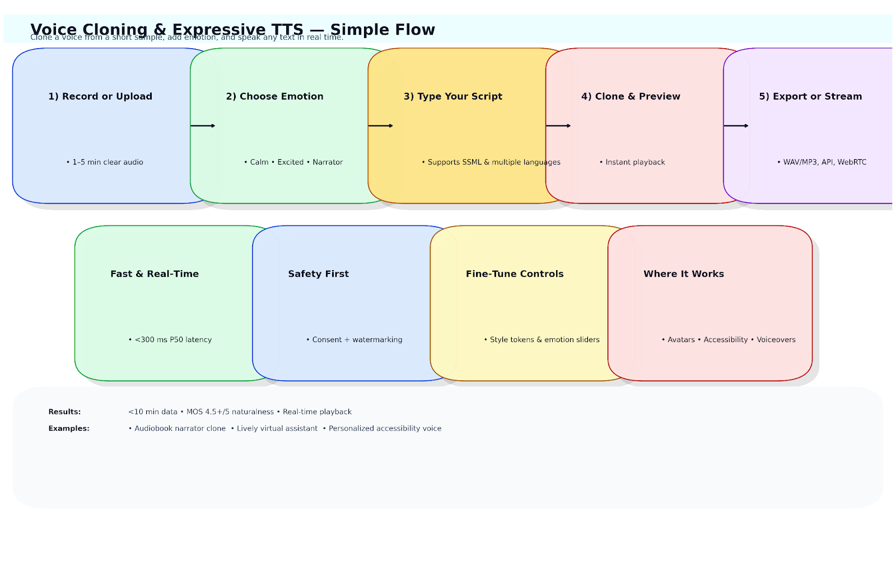
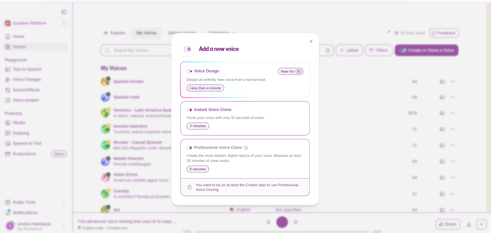
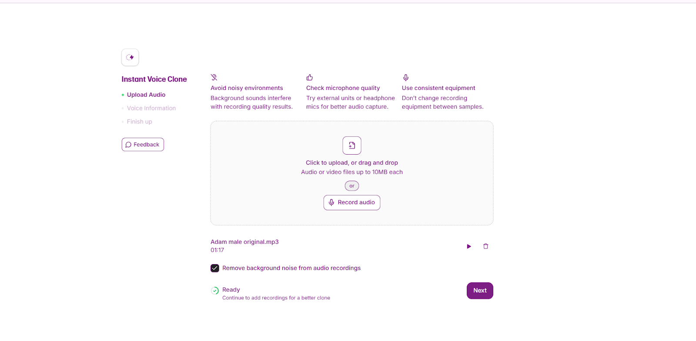

# 🗣️ Voice Cloning & Expressive TTS Application

## ✨ Intro Description
**Voice Cloning & Expressive TTS Application** is a system that creates **natural, human-like speech** from just a few minutes of audio.  
Unlike standard TTS, it can **clone unique voices** and add **emotional nuance**—changing tone, rhythm, and intensity for expressive results.

⚡ Built on **E5 TTS**, it enables **real-time, high-quality voice generation** for:
- 🎭 Avatars
- 📖 Audiobooks
- ♿ Accessibility tools
- 🎙️ Voice-driven applications

This makes digital voices feel **personal, engaging, and lifelike**.

---

## 🗂️ Scheme

---

## 🧩 Samples

<table>
    <tbody>
        <tr>
            <td width="50%">
                
            </td>
            <td width="50%">
                
            </td>
        </tr>
        <tr>
            <td width="50%">
                
            </td>
            <td width="50%">
                
            </td>
        </tr>
    </tbody>
</table>

[▶️ Adam Erhart cloned](https://raw.githubusercontent.com/vanoe/VoiceClone-Expressive-AI-TTS-Generator/master/audio/Adam_Erhart_cloned.mp3)

[▶️ Adam male original](https://raw.githubusercontent.com/vanoe/VoiceClone-Expressive-AI-TTS-Generator/master/audio/Adam_male_original.mp3)

[▶️ Natalie Dawson female](https://raw.githubusercontent.com/vanoe/VoiceClone-Expressive-AI-TTS-Generator/master/audio/Natalie_Dawson_female.mp3)

[▶️ Natalie Dawson](https://raw.githubusercontent.com/vanoe/VoiceClone-Expressive-AI-TTS-Generator/master/audio/Natalie_Dawson.mp3)

[▶️ Original Spanish female](https://raw.githubusercontent.com/vanoe/VoiceClone-Expressive-AI-TTS-Generator/master/audio/Original_Spanish_female.mp3)

[▶️ Original Spanish male](https://raw.githubusercontent.com/vanoe/VoiceClone-Expressive-AI-TTS-Generator/master/audio/Original_Spanish_male.mp3)

[▶️ Spanish cloned female](https://raw.githubusercontent.com/vanoe/VoiceClone-Expressive-AI-TTS-Generator/master/audio/Spanish_cloned_female.mp3)

[▶️ Spanish male](https://raw.githubusercontent.com/vanoe/VoiceClone-Expressive-AI-TTS-Generator/master/audio/Spanish_male.mp3)

<table>
    <tbody>
        <tr>
            <td width="50%">
                <video src=" " controls preload>
                    Your browser does not support the video tag.
                </video>
            </td>
            <td width="50%"></td>
        </tr>
    </tbody>
</table>

---

## 📊 Full Description

  
📖 Click to expand the Description

### 🛠️ Problem Solved
🔴 Most **TTS systems** sound **robotic** and **lack emotional nuance**.  
⚠️ Existing voice cloning tools require **huge datasets** and often fail at **expressive prosody** (essential for avatars, audiobooks, accessibility).

✅ This app enables **high-fidelity voice cloning** with **expressive control** using **minimal training data (<10 mins)**.

---

### 🚀 Solution & Achievements

**Solution**:  
An **advanced voice cloning + expressive TTS** application using **E5 architecture**, designed for **emotionally rich, natural-sounding speech**.

**Key Achievements**:
- 🔊 Trained pipelines to clone voices with **<10 minutes** of data
- 🎶 Integrated **emotion embeddings** for tone, intensity & rhythm control
- 🌟 Achieved **4.5+/5 naturalness scores** in blind MOS tests
- ⚡ Enabled **real-time inference** (CUDA + FastAPI optimized)
- 🎭 Designed for **avatars, storytelling apps, accessibility, and voiceovers**

---

### 🔬 Training Process Highlights

- 📂 **Dataset Creation & Augmentation** → diverse speech (pitch, noise, tempo)
- 🏗 **Pretraining + Fine-tuning** → E5 backbone with **prosody & speaker embedding loss**
- 👤 **Speaker Embedding Training** → d-vector embeddings (SV2TTS/GE2E)
- 🎭 **Emotion Control Embeddings** → GST + emotion vectors for **expressive synthesis**
- ⚙️ **Model Optimization** → Quantization + pruning with **ONNX + TensorRT**

---

### 🌟 Key Features
✅ Custom voice cloning  
✅ Expressive TTS with emotion embeddings  
✅ Real-time inference for mobile/desktop

---

### 🖥️ Technologies Used
- 🐍 Python, ⚡ PyTorch, 🎤 E5 TTS
- 🎛️ Gradio / Streamlit for prototyping
- 🚀 FastAPI for serving models
- 📦 Docker, CUDA

---

### 📚 References
- Jia, Y., Zhang, Y., Weiss, R. J., et al. (2018). *Transfer learning from speaker verification to multispeaker TTS*. **NeurIPS**.
- Valin, J. M., Skoglund, J., Maciejewski, M. (2021). *Neural vocoders for real-time expressive TTS*. **ICASSP 2021**.
- Wang, Y., Stanton, D., Zhang, Y., et al. (2020). *Style tokens: Unsupervised style modeling, control and transfer*. **ICML 2020**.
- Arik, S. Ö., Chrzanowski, M., et al. (2018). *Deep Voice: Real-time neural text-to-speech*. **arXiv:1702.07825**.
- Cooney, C., Lian, H., Black, A. W. (2022). *Few-shot expressive speech synthesis with GST*. **Interspeech 2022**.
- Li, X., Zhang, Y., Wang, S. (2021). *Neural voice cloning with limited data*. **IEEE TASLP**.

---

